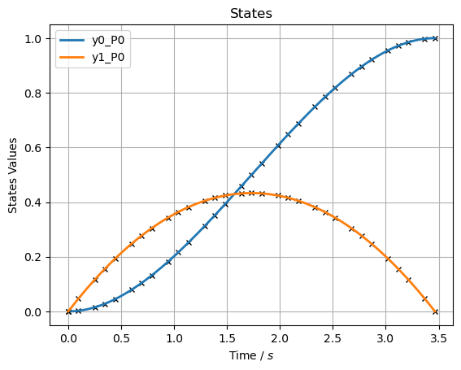
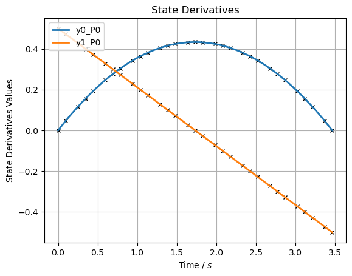
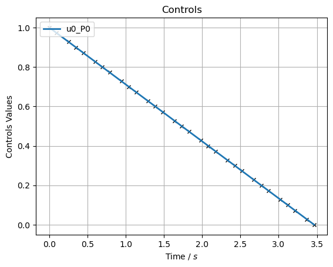

Blockslide 1
------------

Table of Contents
~~~~~~~~~~~~~~~~~

-  OCP Description
-  Parameter variables
-  Problem specific auxiliary data
-  Phases
-  Time
-  State variables, initialisation and bounds
-  Guess
-  State equations
-  Phase specific auxiliary data
-  Path constraints
-  Integrand functions
-  Objective function
-  Settings
-  Solve
-  Solution

OCP Description
~~~~~~~~~~~~~~~

To first show simple implementation of an optimization in pycollo we
will solve a block slide. A block will be pushed in 1D by a force (Fx)
an should reach a certain position ending with 0 speed with friction
(Ff). The objective is to minimize pushing force. To describe this
problem we need two state variables (position x and speed dx), one
control variable (Applied force Fx), and three static parameters to
describe friction (gravitation g, mass m, and coefficient of friction
mu). We will introduce a second order differential to be able to solve
the differential equations for the equations of motion.

.. code:: ipython3

    # 1D Blockslide
    import matplotlib.pyplot as plt
    import numpy as np
    import sympy as sym
    import pycollo
    
    # State variables
    x = sym.Symbol("x")  # Position (m) of the point horizontally from the origin (x-axis)
    dx = sym.Symbol("dx")  # Velocity (m/s) of the point horizontally (x-axis)
    # Control variables
    Fx = sym.Symbol("Fx")  # Force (N) applied to the point horizontally (x-axis)
    
    # Static parameter variable
    g = sym.Symbol("g")
    m = sym.Symbol("m")  # Mass (kg) of the point
    mu = sym.Symbol("mu")
    # m = 2
    # g = 9.81
    # mu = 0.5
    Ff = m * g * mu
    
    # State equation variables
    ddx = sym.Symbol("ddx")  # Acceleration (m/s^2) of the point horizontal (x-axis)

.. parsed-literal::

    /Users/j.t.heinen/miniconda3/envs/rosetta/lib/python3.10/site-packages/ipopt/__init__.py:13: FutureWarning: The module has been renamed to 'cyipopt' from 'ipopt'. Please import using 'import cyipopt' and remove all uses of 'import ipopt' in your code as this will be deprecated in a future release.
      warnings.warn(msg, FutureWarning)

Parameter variables
~~~~~~~~~~~~~~~~~~~

To initialise an OCP in pycollo start by creating the name and
introducing optimised parameters. These are provided in a list or tuple.
When these variables are optimised, they will be optimised to a single
constant number over all phases. It is good to note that ALWAYS when you
want anything to be optimised, make sure bounds and guesses are
supplied, otherwise Pycollo cannot run. Bounds can be assigned with list
of list, tuples, array, or dictionary.

.. code:: ipython3

    # Problem instantiation
    problem = pycollo.OptimalControlProblem(
        name="Simple Block Slide",
        parameter_variables= (m,mu)
        )
    problem.bounds.parameter_variables = [[1,2], [0.5,1]]
    problem.guess.parameter_variables = [1.5, 0.75]

Problem specific auxiliary data
~~~~~~~~~~~~~~~~~~~~~~~~~~~~~~~

Non optimised static parameters should be assigned a numerical value.
This is done through auxiliary data. Auxiliary data is a dictionary
where symbols can be assigned to numerical values, or sympy
expressions(we will show this later). If you want to exclude the
variables from all equations in the OCP, you can make sure the variables
are numerical before introducing them into the
pycollo.OptimalControlProblem

.. code:: ipython3

    problem.auxiliary_data = {g: 9.81}

Phases
~~~~~~

The OCP is introduced, now we should start by introducing the phases.
Eventhough we are only using a single phase for this OCP, the nature of
Pycollo is multiphase, so phases should always be declared.

.. code:: ipython3

    phase_A = problem.new_phase(name="A")

Time
~~~~

Each phase typically has a certain timespan. We wan’t the time to start
at 0 and will constrain the OCP to do so. By setting a single numerical
number the initial time will be 0. Pycollo allows the initial and final
time variables to be optimised. When a bound is provided time will be
optimised. In this example, we don’t know what the final time will be
and thus final time will be optimised by a provided bound. A guess
should be provided for time. Time guess should minimally be for the
initial time and final time, but can expand to as many points as needed
by providing a list of n numbers. Make sure to match length n with all
other guesses (except for problem.guess.parameter_variables)

.. code:: ipython3

    phase_A.bounds.initial_time = 0
    phase_A.bounds.final_time = [0, 5]
    phase_A.guess.time = [0, 1]

State variables, initialisation and bounds
~~~~~~~~~~~~~~~~~~~~~~~~~~~~~~~~~~~~~~~~~~

The phase should know what the state variables and control variables
are. Variables should be sympy symbols. Bounds and guesses have to be
numerical and cannot include symbolic variables. Bounds are defined as
the allowable operating range of the given variables. Bounds can be
provided to Pycollo as a list, list of list, tuple of list, numpy array,
or dictionary. When the bounds ar supplied with a list, tuple or numpy
array, Pycollo will couple the values with by index. Bounds are set
outside around the objective with a reasonable amount of play such that
the optimisation will not operate at it’s bound (unless there is an
actual bound in the problem).

.. code:: ipython3

    phase_A.state_variables = [x, dx]
    phase_A.bounds.state_variables = [[-3,3],[-50,50]]

The dictionary is implemented by coupling a lower and upper bound
through a list to the variables:

.. code:: ipython3

    phase_A.bounds.state_variables = {
        x: [-3, 3],
        dx: [-50, 50],
    }

Now the optimiser should know where the numerical initial and final
state variables of this phase. Once again, when this should be
optimised, you can assign a bound to these values, just like the
parameter variables. Initial and final state constraints can also be
assigned by a list, array or tuple

.. code:: ipython3

    phase_A.bounds.initial_state_constraints = {
        x: 0,
        dx: 0,
    }
    phase_A.bounds.final_state_constraints = {
        x: 1,
        dx: 0,
    }

Guess
~~~~~

The state variables are optimised, and thus need a guess. The guess of
the state variables should, just like time, minimally include initial
and final time. When n number of points is used for the time guess,
state_variables guess should have n number of guesses per variable wich
match the time by index. Minimal guessing would include initial and
final time variables. Guesses are assigned with a list of lists, tuple,
or array. Usually a zero guess seed is sufficient in this method. To
converge quicker or make sure no local minima is found, proper guessing
is needed.

.. code:: ipython3

    phase_A.guess.state_variables = [[0, 0], [0, 0]]

Control variables
~~~~~~~~~~~~~~~~~

The control variables are handeled the same as state variables, but
don’t need initial and final state constraints:

.. code:: ipython3

    phase_A.control_variables = [Fx]
    phase_A.bounds.control_variables = {
        Fx: [-50, 50],
    }
    phase_A.guess.control_variables = [
            [0, 0],
        ]

State equations
~~~~~~~~~~~~~~~

The integration over time can only be done when the differential
equations of the blockslide are provided to Pycollo. The differential
equations can be provided to Pycollo in three ways. First you can
provide the equations directly:

.. code:: ipython3

    phase_A.state_equations = {
        x: dx,
        dx: Fx / m - m*mu,
    }

Phase specific auxiliary data
~~~~~~~~~~~~~~~~~~~~~~~~~~~~~

Secondly, you can provide it through auxiliary data, which results in
fundamentally the same solution. Here you can see that auxiliary data
can be used to assign expressions to variables. There are two kinds of
auxiliary data: 1. Auxiliary data valid for all phases
(problem.auxiliary_data) or specific per phase (phase_A.auxiliary_data).
This can be helpful because constants can be different per phase.

.. code:: ipython3

    phase_A.state_equations = {
        x: dx,
        dx: ddx,
    }
    phase_A.auxiliary_data = {
        ddx: Fx / m - m*mu, 
    }
    phase_A.guess.control_variables = [
            [0, 0],
        ]

Path constraints
~~~~~~~~~~~~~~~~

Thirdly, you can provide state equations with path constraints (also
known as, inequality constraints). This is fundamentally different from
the previous methods since the equations will be handled in the
constraint space. Usually this will result in quicker, less acurate
results (depending on NLP tolerance), but is sometimes necesary for
example in bang bang control. We will not use this for now because this
is not necessary. Later expansion of this example will elaborate on path
constraints

.. code:: ipython3

    # phase_A.path_constraints = [ddx - (Fx / m - m*mu)]
    # phase_A.bounds.path_constraints = [0]

Integrand functions
~~~~~~~~~~~~~~~~~~~

The only step left is to implement an objective. The objective is to
slide the block to the endpoint while minimizing input Fx. To make sure
we minimize Fx over the whole time domain we should integrate Fx. To
include negative effort in the equation we can square Fx. The bounds
should be given for initial and final time, and the guess is a single
number, since the output of the function will always result in a single
number.

.. code:: ipython3

    phase_A.integrand_functions = [Fx ** 2]
    phase_A.bounds.integral_variables = [[0, 1000]]
    phase_A.guess.integral_variables = [0]

Objective function
~~~~~~~~~~~~~~~~~~

Objective functions should always be a function of initial or final
state variables.

.. code:: ipython3

    problem.objective_function = (
        phase_A.integral_variables[0])

Settings
~~~~~~~~

Before solving the OCP we can alter Pycollo’s default settings such as
number of collocation points, amount of mesh sections, NLP tolerance,
see al options in [INSERT_LINK_TO_SETTINGS]. For now we will use
Pycollo’s default sttings and will use it’s internal plotting method to
show the results. Then we will solve the OCP with:

.. code:: ipython3

    # Settings
    problem.settings.display_mesh_result_graph = True

Solve
~~~~~

.. code:: ipython3

    # Solve
    problem.initialise()
    problem.solve()

.. parsed-literal::

    
    =====================================
    Initialising optimal control problem.
    =====================================
    
    Phase variables and equations checked.
    Pycollo variables and constraints preprocessed.
    Backend initialised.
    Bounds checked.
    Problem scaling initialised.
    Quadrature scheme initialised.
    Backend postprocessing complete.
    Initial mesh created.
    Initial guess checked.
    
    ===============================
    Initialising mesh iteration #1.
    ===============================
    
    Guess interpolated to iteration mesh in 759.67us.
    Scaling initialised in 49.37us.
    Initial guess scaled in 5.71us.
    Scaling generated in 2.28ms.
    NLP generated in 48.49ms.
    Mesh-specific bounds generated in 178.83us.
    
    Mesh iteration #1 initialised in 51.77ms.
    
    
    ==========================
    Solving mesh iteration #1.
    ==========================
    
    
    ******************************************************************************
    This program contains Ipopt, a library for large-scale nonlinear optimization.
     Ipopt is released as open source code under the Eclipse Public License (EPL).
             For more information visit https://github.com/coin-or/Ipopt
    ******************************************************************************
    
    This is Ipopt version 3.14.9, running with linear solver MUMPS 5.2.1.
    
    Number of nonzeros in equality constraint Jacobian...:      499
    Number of nonzeros in inequality constraint Jacobian.:        0
    Number of nonzeros in Lagrangian Hessian.............:      126
    
    Total number of variables............................:       93
                         variables with only lower bounds:        0
                    variables with lower and upper bounds:       93
                         variables with only upper bounds:        0
    Total number of equality constraints.................:       61
    Total number of inequality constraints...............:        0
            inequality constraints with only lower bounds:        0
       inequality constraints with lower and upper bounds:        0
            inequality constraints with only upper bounds:        0
    
    iter    objective    inf_pr   inf_du lg(mu)  ||d||  lg(rg) alpha_du alpha_pr  ls
       0  9.9999900e+00 1.67e-01 0.00e+00   0.0 0.00e+00    -  0.00e+00 0.00e+00   0
       1  9.9990000e-02 1.65e-02 4.38e+01  -6.3 1.66e-01    -  7.43e-01 9.90e-01f  1
       2  4.0937523e+00 1.47e-02 4.00e+01  -1.4 4.63e+00   0.0 1.05e-01 1.01e-01h  1
       3  2.2473369e+01 5.10e-03 7.36e+00  -1.2 1.02e-01    -  1.00e+00 1.00e+00h  1
       4  2.2472379e-01 4.51e-03 2.54e+00  -1.6 1.37e-01    -  9.84e-01 8.75e-01f  1
       5  3.5765401e-01 3.89e-03 1.51e+01  -1.7 6.79e-01    -  1.00e+00 1.40e-01h  1
       6  1.6777998e+00 2.30e-03 3.22e+00  -1.9 4.34e-01    -  1.00e+00 7.28e-01h  1
       7  1.1078523e+00 2.66e-03 3.76e-01  -2.3 1.33e-01    -  9.99e-01 1.00e+00h  1
       8  1.1321827e+00 1.34e-03 2.60e+00  -3.3 1.43e-01    -  1.00e+00 7.91e-01h  1
       9  1.1411053e+00 3.79e-04 3.06e-02  -4.0 9.21e-02    -  1.00e+00 1.00e+00h  1
    iter    objective    inf_pr   inf_du lg(mu)  ||d||  lg(rg) alpha_du alpha_pr  ls
      10  1.1542439e+00 1.54e-05 1.08e-03  -5.5 2.04e-02    -  1.00e+00 9.88e-01h  1
      11  1.1547004e+00 1.56e-08 1.06e-06  -7.6 8.02e-04    -  1.00e+00 1.00e+00h  1
      12  1.1547005e+00 3.59e-14 3.89e-12 -11.0 1.07e-06    -  1.00e+00 1.00e+00h  1
    
    Number of Iterations....: 12
    
                                       (scaled)                 (unscaled)
    Objective...............:   1.1547004808427914e-01    1.1547004808427914e+00
    Dual infeasibility......:   3.8947988362866978e-12    3.8947988362866978e-11
    Constraint violation....:   3.5938844492970169e-14    3.5938844492970169e-14
    Variable bound violation:   9.9752962556820535e-09    9.9752962556820535e-09
    Complementarity.........:   1.0311194939135614e-11    1.0311194939135613e-10
    Overall NLP error.......:   1.0311194939135614e-11    1.0311194939135613e-10
    
    
    Number of objective function evaluations             = 13
    Number of objective gradient evaluations             = 13
    Number of equality constraint evaluations            = 13
    Number of inequality constraint evaluations          = 0
    Number of equality constraint Jacobian evaluations   = 13
    Number of inequality constraint Jacobian evaluations = 0
    Number of Lagrangian Hessian evaluations             = 12
    Total seconds in IPOPT                               = 0.022
    
    EXIT: Optimal Solution Found.
          solver  :   t_proc      (avg)   t_wall      (avg)    n_eval
           nlp_f  |  16.00us (  1.23us)  12.21us (938.92ns)        13
           nlp_g  |  69.00us (  5.31us)  65.25us (  5.02us)        13
      nlp_grad_f  |  31.00us (  2.07us)  26.42us (  1.76us)        15
      nlp_hess_l  |  96.00us (  8.00us)  92.46us (  7.70us)        12
       nlp_jac_g  | 152.00us ( 10.86us) 148.50us ( 10.61us)        14
           total  |  21.74ms ( 21.74ms)  31.78ms ( 31.78ms)         1
    
    ==================================
    Post-processing mesh iteration #1.
    ==================================
    
    Mesh iteration #1 solved in 32.44ms.
    Mesh iteration #1 post-processed in 21.46ms.
    
    
    ============================
    Analysing mesh iteration #1.
    ============================
    
    Objective Evaluation:       1.1547004808427914
    Max Relative Mesh Error:    2.0754418645873966e-13
    Collocation Points Used:    31
    
    Adjusting Collocation Mesh: [10] mesh sections
    
    Mesh iteration #1 completed in 105.67ms.
    

.. parsed-literal::

    Mesh tolerance met in mesh iteration 1.
    
    
    ===========================================
    Optimal control problem sucessfully solved.
    ===========================================
    
    Final Objective Function Evaluation: 1.1547
    

Solution
~~~~~~~~

All results can be found in problem.solution, see
[INSERT_LINK_TO_SOLUTION]

