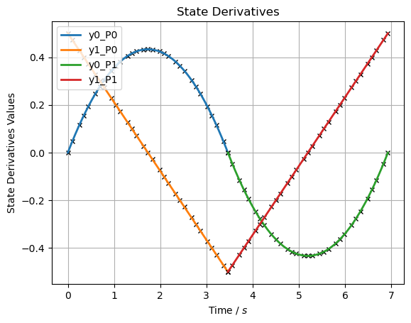

Blockslide 2
============

OCP Description
---------------

Let’s introduce a second phase to the previous example where the block
will have to return to it’s original position. Because we know friction
will switch direction when we slide the block back, the equations of
motion change. Since phase A will not change, lets copy everything up
until we start initiating the objective function.

.. code:: 

    # 1D Blockslide
    import matplotlib.pyplot as plt
    import numpy as np
    import sympy as sym
    import pycollo
    
    # State variables
    x = sym.Symbol("x")  # Position (m) of the point horizontally from the origin (x-axis)
    dx = sym.Symbol("dx")  # Velocity (m/s) of the point horizontally (x-axis)
    # Control variables
    Fx = sym.Symbol("Fx")  # Force (N) applied to the point horizontally (x-axis)
    
    # Static parameter variable
    g = sym.Symbol("g")
    m = sym.Symbol("m")  # Mass (kg) of the point
    mu = sym.Symbol("mu")
    # m = 2
    # g = 9.81
    # mu = 0.5
    Ff = m * g * mu
    
    # State equation variables
    ddx = sym.Symbol("ddx")  # Acceleration (m/s^2) of the point horizontal (x-axis)
    
    # Problem instantiation
    problem = pycollo.OptimalControlProblem(
        name="Simple Block Slide",
        parameter_variables= (m,mu)
        )
    problem.bounds.parameter_variables = [[1,2], [0.5,1]]
    problem.guess.parameter_variables = [1.5, 0.75]
    problem.auxiliary_data = {g: 9.81}
    
    phase_A = problem.new_phase(name="A")
    phase_A.bounds.initial_time = 0
    phase_A.bounds.final_time = [0, 10]
    phase_A.guess.time = [0, 1]
    
    phase_A.state_variables = [x, dx]
    phase_A.bounds.state_variables = [[-3,3],[-50,50]]
    phase_A.bounds.state_variables = {
        x: [-3, 3],
        dx: [-50, 50],}
    phase_A.bounds.initial_state_constraints = {
        x: 0,
        dx: 0,}
    phase_A.bounds.final_state_constraints = {
        x: 1,
        dx: 0,}
    phase_A.guess.state_variables = [[0, 0], [0, 0]]
    
    phase_A.control_variables = [Fx]
    phase_A.bounds.control_variables = {
        Fx: [-50, 50],}
    phase_A.guess.control_variables = [
            [0, 0],]
    
    phase_A.state_equations = {
        x: dx,
        dx: Fx / m - m*mu,}
    
    phase_A.integrand_functions = [Fx ** 2]
    phase_A.bounds.integral_variables = [[0, 1000]]
    phase_A.guess.integral_variables = [0]

New phase
---------

Now we can copy the previous phase completely to initiate a new phase
completely the same. When doing this make sure you overwrite everything
that changes in this next phase. It is real easy to make mistakes like
this and it is recommended to write out the full phase description as
depicted above.

.. code:: 

    phase_B = problem.new_phase_like(
        phase_for_copying=phase_A,
        name="B",
    )

Now we can start overwriting everything that will be different from the
previous phase:

-  Time Phase B initial time can start any moment within bounds, final
   time the same
-  Initial and final state constraints The block starts at final state
   of phase A, and will end at 0.
-  State equations Friction changes sign

.. code:: 

    # Time 
    phase_B.bounds.initial_time = [0, 10]
    phase_B.bounds.final_time = [0, 10]
    phase_B.guess.time = [1, 2]
    
    # Initial and final state constraints
    phase_B.bounds.initial_state_constraints = {
        x: 1,
        dx: 0,}
    phase_B.bounds.final_state_constraints = {
        x: 0,
        dx: 0,}
    
    # State equations
    phase_B.state_equations = {
        x: dx,
        dx: Fx / m + m*mu,}

Endpoint constraints
--------------------

To make sure all variables are continious, sometimes endpoint
constraints need to be implemented. Endpoint constraints are
constraintes which exist of initial and final variables. When final and
initial states are not bound to a single value, phase A final states
should match phase B initial states to make the states continious. In
this example, the states are constrainted to be continious due to the
initial and final state constraints of both phases. Time variables are
not constrained to be continious (yet) thus we can implement the
following inequality constraint (final time phase A = initial time phase
B -> final time phase A - initial time phase B = 0):

.. code:: 

    problem.endpoint_constraints = [
        phase_A.final_time_variable - phase_B.initial_time_variable,
    ]
    problem.bounds.endpoint_constraints = [
        0,
    ]

Objective function - multiphase
-------------------------------

Now the objective to minimize input force Fx should als be updated to
consider both phases, the integrand functions are created with the
copying of the new phase but are yet to be implemented in the objective:

.. code:: 

    problem.objective_function = (
        phase_A.integral_variables[0] + phase_B.integral_variables[0])

.. code:: 

    # Bug
    phase_B.guess.integral_variables = 0

Solve
~~~~~

.. code:: 

    problem.settings.display_mesh_result_graph = True
    problem.initialise()
    problem.solve()

.. parsed-literal::

    
    =====================================
    Initialising optimal control problem.
    =====================================
    
    Phase variables and equations checked.
    Pycollo variables and constraints preprocessed.
    Backend initialised.
    Bounds checked.
    Problem scaling initialised.
    Quadrature scheme initialised.
    Backend postprocessing complete.
    Initial mesh created.
    Initial guess checked.
    
    ===============================
    Initialising mesh iteration #1.
    ===============================
    
    Guess interpolated to iteration mesh in 1.17ms.
    Scaling initialised in 69.12us.
    Initial guess scaled in 3.58us.
    Scaling generated in 3.17ms.
    NLP generated in 64.76ms.
    Mesh-specific bounds generated in 221.17us.
    
    Mesh iteration #1 initialised in 69.39ms.
    
    
    ==========================
    Solving mesh iteration #1.
    ==========================
    
    
    ******************************************************************************
    This program contains Ipopt, a library for large-scale nonlinear optimization.
     Ipopt is released as open source code under the Eclipse Public License (EPL).
             For more information visit https://github.com/coin-or/Ipopt
    ******************************************************************************
    
    This is Ipopt version 3.14.9, running with linear solver MUMPS 5.2.1.
    
    Number of nonzeros in equality constraint Jacobian...:     1061
    Number of nonzeros in inequality constraint Jacobian.:        0
    Number of nonzeros in Lagrangian Hessian.............:      312
    
    Total number of variables............................:      185
                         variables with only lower bounds:        0
                    variables with lower and upper bounds:      185
                         variables with only upper bounds:        0
    Total number of equality constraints.................:      123
    Total number of inequality constraints...............:        0
            inequality constraints with only lower bounds:        0
       inequality constraints with lower and upper bounds:        0
            inequality constraints with only upper bounds:        0
    
    iter    objective    inf_pr   inf_du lg(mu)  ||d||  lg(rg) alpha_du alpha_pr  ls
       0  1.9999980e+01 1.67e-01 0.00e+00   0.0 0.00e+00    -  0.00e+00 0.00e+00   0
       1  1.9998000e-01 1.92e-02 8.90e+01  -6.3 1.66e-01    -  7.43e-01 9.90e-01f  1
       2  7.9128390e+01 8.11e-02 9.37e+02  -1.0 1.38e-01   2.0 9.74e-01 1.00e+00h  1
       3  1.0175344e+02 1.83e-02 8.97e+02   0.8 3.85e-02   3.3 9.83e-01 1.00e+00f  1
       4  4.7430390e+01 5.89e-03 1.10e+02   0.4 1.35e-01    -  8.25e-01 8.61e-01F  1
       5  5.5138401e+01 3.48e-03 6.63e+01  -0.2 4.14e-02   2.9 1.00e+00 1.00e+00f  1
       6  5.8070646e+00 7.75e-03 1.24e+01  -0.7 1.32e-01    -  1.00e+00 7.43e-01f  1
       7  3.8485271e+00 3.20e-03 2.15e+00  -1.4 2.77e-01    -  1.00e+00 1.00e+00f  1
       8  1.4981079e+00 3.57e-03 2.87e+01  -1.5 2.79e-01    -  9.99e-01 4.25e-01f  1
       9  4.3350110e+00 3.42e-04 7.66e+00  -0.8 1.66e-02   2.4 1.00e+00 1.00e+00f  1
    iter    objective    inf_pr   inf_du lg(mu)  ||d||  lg(rg) alpha_du alpha_pr  ls
      10  4.8790561e+00 7.20e-06 2.16e+01  -0.9 1.83e-03   2.8 9.51e-01 1.00e+00h  1
      11  3.0212572e+00 1.70e-03 5.27e-01  -1.6 9.20e-02    -  1.00e+00 1.00e+00f  1
      12  2.2431919e+00 1.01e-03 5.07e-01  -2.6 1.43e-01    -  1.00e+00 9.79e-01h  1
      13  2.3103126e+00 1.42e-04 2.23e-02  -3.3 5.79e-02    -  9.99e-01 1.00e+00h  1
      14  2.3093466e+00 3.83e-06 6.91e-04  -5.0 8.11e-03    -  1.00e+00 9.98e-01h  1
      15  2.3094025e+00 2.77e-09 3.30e-07  -7.1 2.30e-04    -  1.00e+00 1.00e+00h  1
      16  2.3094010e+00 1.21e-14 2.52e-12 -11.0 3.38e-07    -  1.00e+00 1.00e+00h  1
    
    Number of Iterations....: 16
    
                                       (scaled)                 (unscaled)
    Objective...............:   2.3094009614871425e-01    2.3094009614871425e+00
    Dual infeasibility......:   2.5167035620248926e-12    2.5167035620248926e-11
    Constraint violation....:   1.2129186544029835e-14    1.2129186544029835e-14
    Variable bound violation:   9.9876485970540330e-09    9.9876485970540330e-09
    Complementarity.........:   1.0135020217209090e-11    1.0135020217209090e-10
    Overall NLP error.......:   1.0135020217209090e-11    1.0135020217209090e-10
    
    
    Number of objective function evaluations             = 18
    Number of objective gradient evaluations             = 17
    Number of equality constraint evaluations            = 18
    Number of inequality constraint evaluations          = 0
    Number of equality constraint Jacobian evaluations   = 17
    Number of inequality constraint Jacobian evaluations = 0
    Number of Lagrangian Hessian evaluations             = 16
    Total seconds in IPOPT                               = 0.027
    
    EXIT: Optimal Solution Found.
          solver  :   t_proc      (avg)   t_wall      (avg)    n_eval
           nlp_f  |  18.00us (  1.00us)  15.83us (879.50ns)        18
           nlp_g  | 164.00us (  9.11us) 154.17us (  8.56us)        18
      nlp_grad_f  |  34.00us (  1.79us)  32.88us (  1.73us)        19
      nlp_hess_l  | 266.00us ( 16.63us) 264.62us ( 16.54us)        16
       nlp_jac_g  | 354.00us ( 19.67us) 354.75us ( 19.71us)        18
           total  |  31.11ms ( 31.11ms)  33.45ms ( 33.45ms)         1
    
    ==================================
    Post-processing mesh iteration #1.
    ==================================
    
    Mesh iteration #1 solved in 33.98ms.
    Mesh iteration #1 post-processed in 42.83ms.
    
    
    ============================
    Analysing mesh iteration #1.
    ============================
    
    Objective Evaluation:       2.3094009614871425
    Max Relative Mesh Error:    1.0546653493726253e-13
    Collocation Points Used:    62
    
    Adjusting Collocation Mesh: [10, 10] mesh sections
    
    Mesh iteration #1 completed in 146.20ms.
    

.. image:: output_12_1.png

.. parsed-literal::

    Mesh tolerance met in mesh iteration 1.
    
    
    ===========================================
    Optimal control problem sucessfully solved.
    ===========================================
    
    Final Objective Function Evaluation: 2.3094
    

Solution
~~~~~~~~

All results can be found in problem.solution, see
[INSERT_LINK_TO_SOLUTION]

