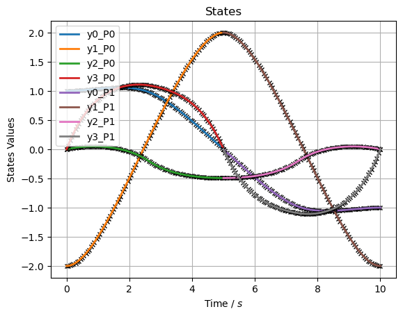
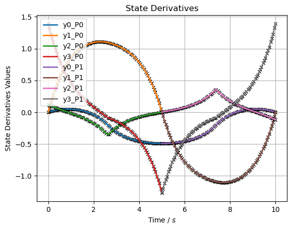
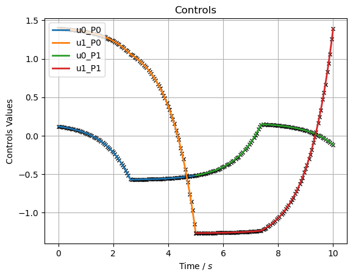
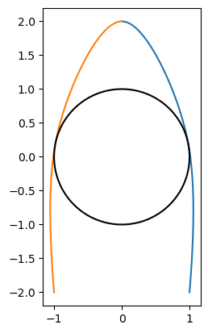

Block Slide 3
=============

OCP Description
---------------

Lets introduce an extra dimension. Now the block can slide in 2D. We
will assume the block is on 4 cartwheels and can move freely without
friction. Lets add linear drag in both directions with a coefficient of
friction of 1.05. The block starts at (1,-2) with zero speed, should
reach the mid position (0,2) with any given speed, and final position
(-1,-2) with zero speed, while dodging an circular object with a radius
of 1[m] at (0,0) while minimizing input force.

.. code:: ipython3

    # 2D Blockslide
    import matplotlib.pyplot as plt
    import numpy as np
    import sympy as sym
    import pycollo
    
    # State variables
    x = sym.Symbol("x")  # Position (m) of the point horizontally from the origi(x-axis)
    dx = sym.Symbol("dx")  # Velocity (m/s) of the point horizontally (x-axis)
    # Control variables
    y = sym.Symbol("y")  # Position (m) of the point horizontally from the origi(x-axis)
    dy = sym.Symbol("dy")  # Velocity (m/s) of the point horizontally (x-axis)
    # Control variables
    Fx = sym.Symbol("Fx")  # Force (N) applied to the point horizontally (x-axis)
    Fy = sym.Symbol("Fy")  # Force (N) applied to the point horizontally (x-axis)
    
    r = 1.0
    b = 1.05
    
    # Static parameter variable
    m = sym.Symbol("m")  # Mass (kg) of the point
    
    # Problem instantiation
    problem = pycollo.OptimalControlProblem(
        name="2D Block Slide",
        parameter_variables= (m)
        )
    problem.bounds.parameter_variables = [[1,2]]
    problem.guess.parameter_variables = [1.5]
    
    phase_A = problem.new_phase(name="A")
    phase_A.bounds.initial_time = 0
    phase_A.bounds.final_time = [0, 10]
    phase_A.guess.time = [0, 1]

States and Control
------------------

State bounds, control, and integrand functions will be the same as the
previous example but with an added dimension.

.. code:: ipython3

    
    phase_A.state_variables = [x, y, dx, dy]
    phase_A.bounds.state_variables = [[-3,3],[-50,50]]
    phase_A.bounds.state_variables = {
        x: [-3, 3],
        y: [-3, 3],
        dx: [-50, 50],
        dy: [-50, 50],}
    
    phase_A.control_variables = [Fx, Fy]
    phase_A.bounds.control_variables = {
        Fx: [-50, 50], 
        Fy: [-50,50]}
    phase_A.guess.control_variables = [
            [0, 0],[0, 0]]
    
    phase_A.integrand_functions = [Fx ** 2, Fy**2 ]
    phase_A.bounds.integral_variables = [[0, 1000],[0,1000]]
    phase_A.guess.integral_variables = [[0],[0]]

We will split the two phases by the two points the block should reach.
The first phase will stop at the midpoint. Final state of dx and dy
should be unconstrained and are set at the same limit as the
statebounds.

.. code:: ipython3

    phase_A.bounds.initial_state_constraints = {
        x: 1,
        y: -2,
        dx: 0,
        dy: 0,}
    phase_A.bounds.final_state_constraints = {
        x: 0,
        y: 2,
        dx: [-50, 50],
        dy: [-50, 50], }
    phase_A.guess.state_variables = [[1, 0], [-2, 2], [0,0], [0,0]]

The state equations will be the same with an extra dimension and linear
drag added to the equation.

.. code:: ipython3

    phase_A.state_equations = {
        x: dx,
        y: dy,
        dx: Fx / m - b/m *dx,
        dy: Fy / m - b/m *dy}

Path Constraints
----------------

Path constraints or inequality constraints, are constraints made up of
continious time variables in contradiction with endpoint constraints.
Path constraints are relatively hard to solve for the optimizer and
should not be used when not necessary.

The circular object with radius 1[m] located at (0,0) can be made with
an inequality constraint. With the circle equation we can make sure x
and y will be out of the circle at any time within phase A with a
maximum of 10[m] distance.

.. code:: ipython3

    phase_A.path_constraints = [sym.sqrt(x ** 2 + y ** 2) - r]
    phase_A.bounds.path_constraints = [[0, 10]]

New phase
---------

Now we can copy the previous phase completely to initiate a new phase
completely the same.

.. code:: ipython3

    phase_B = problem.new_phase_like(
        phase_for_copying=phase_A,
        name="B",)

Now we overwrite everything that will be different from the last phase

-  Time Phase B initial time can start any moment within bounds, final
   time the same
-  Initial and final state constraints The initial condition of phase B
   should be the same as the final state as phase A. The final location
   and speeds are implemented as described in the OCP

.. code:: ipython3

    # Time 
    phase_B.bounds.initial_time = [0, 10]
    phase_B.bounds.final_time = [0, 10]
    phase_B.guess.time = [1, 2]
    
    # Initial and final state constraints
    phase_B.bounds.initial_state_constraints = phase_A.bounds.final_state_constraints
    
    phase_B.bounds.final_state_constraints = {
        x: -1,
        y: -2,
        dx: 0,
        dy: 0,}

Endpoint constraints
--------------------

To make sure all variables are continious, sometimes endpoint
constraints need to be implemented. Endpoint constraints are
constraintes which exist of initial and final variables. When final and
initial states are not bound to a single value, phase A final states
should match phase B initial states to make the states continious. Time
variables are not constrained to be continious (yet), thus we can
implement the following inequality constraint (final time phase A =
initial time phase B -> final time phase A - initial time phase B = 0).
In this example, x and y are constrainted to be continious due to the
initial and final state constraints of both phases. The only constraint
we’d like to implement to dx and dy is that the endpoints are
corresponding and thus continious. This is done similarly as time.

.. code:: ipython3

    problem.endpoint_constraints = [
        phase_A.final_time_variable - phase_B.initial_time_variable,
        phase_A.final_state_variables.dx - phase_B.initial_state_variables.dx,
        phase_A.final_state_variables.dy - phase_B.initial_state_variables.dy,]
    problem.bounds.endpoint_constraints = [
        0,
        0,
        0,]

Objective function
------------------

Minimizing input forces is realised with the integrated functions of
phase A and phase B

.. code:: ipython3

    problem.objective_function = (
        phase_A.integral_variables[0] +phase_A.integral_variables[1] + phase_B.integral_variables[0] + phase_B.integral_variables[1])
    # Bug
    phase_B.guess.integral_variables = [[0],[0]]

.. code:: ipython3

    ## Settings
    To converge quicker in this relatively simple OCP, lets reduce the NLP tolerance and mesh tolerance. And lets add more collocations points by increasing the number of mesh sections to account for the lower tolerances.

.. code:: ipython3

    problem.settings.display_mesh_result_graph = True
    problem.settings.nlp_tolerance  = 1e-8
    problem.settings.mesh_tolerance = 1e-6
    
    phase_A.mesh.number_mesh_sections = 30
    phase_B.mesh.number_mesh_sections = 30

Solve and Plot
--------------

.. code:: ipython3

    problem.initialise()
    problem.solve()
    
    ## Plot
    # Create obstacle coordinates
    alpha = np.linspace(0, 2 * np.pi, 1000)
    x_circle = r * np.cos(alpha)
    y_circle = r * np.sin(alpha)
    
    # Plot obstacle and solution in plan view
    x_P0 = problem.solution.state[0][0]
    y_P0 = problem.solution.state[0][1]
    x_P1 = problem.solution.state[1][0]
    y_P1 = problem.solution.state[1][1]
    plt.plot(x_P0, y_P0)
    plt.plot(x_P1, y_P1)
    plt.plot(x_circle, y_circle, color="#000000")
    plt.gca().set_aspect("equal", adjustable="box")
    plt.show()

.. parsed-literal::

    
    =====================================
    Initialising optimal control problem.
    =====================================
    
    Phase variables and equations checked.
    Pycollo variables and constraints preprocessed.
    Backend initialised.
    Bounds checked.
    Problem scaling initialised.
    Quadrature scheme initialised.
    Backend postprocessing complete.
    Initial mesh created.
    Initial guess checked.
    
    ===============================
    Initialising mesh iteration #1.
    ===============================
    
    Guess interpolated to iteration mesh in 1.46ms.
    Scaling initialised in 108.67us.
    Initial guess scaled in 10.62us.
    Scaling generated in 97.59ms.
    NLP generated in 740.12ms.
    Mesh-specific bounds generated in 802.12us.
    
    Mesh iteration #1 initialised in 840.10ms.
    
    
    ==========================
    Solving mesh iteration #1.
    ==========================
    
    This is Ipopt version 3.14.11, running with linear solver MUMPS 5.2.1.
    
    Number of nonzeros in equality constraint Jacobian...:     6820
    Number of nonzeros in inequality constraint Jacobian.:      356
    Number of nonzeros in Lagrangian Hessian.............:     2712
    
    Total number of variables............................:     1088
                         variables with only lower bounds:        0
                    variables with lower and upper bounds:     1088
                         variables with only upper bounds:        0
    Total number of equality constraints.................:      727
    Total number of inequality constraints...............:      182
            inequality constraints with only lower bounds:        0
       inequality constraints with lower and upper bounds:      182
            inequality constraints with only upper bounds:        0
    
    iter    objective    inf_pr   inf_du lg(mu)  ||d||  lg(rg) alpha_du alpha_pr  ls
       0  3.9999960e+01 6.61e-01 0.00e+00   0.0 0.00e+00    -  0.00e+00 0.00e+00   0
       1  3.8935008e+01 6.43e-01 7.75e+00  -1.4 6.76e-01    -  2.15e-01 2.66e-02h  1
       2  3.8974545e+01 6.41e-01 1.38e+02  -6.4 4.90e+00    -  3.36e-02 2.27e-03h  1
       3  4.2225887e+01 5.78e-01 4.58e+02  -0.0 7.83e+00    -  3.06e-02 9.97e-02f  1
       4  4.9172584e+01 5.02e-01 3.61e+02  -0.5 6.49e-01   2.0 3.30e-02 1.31e-01h  1
       5  5.0587662e+01 4.96e-01 4.27e+02   0.0 6.52e-01   2.4 1.00e+00 1.16e-02h  1
       6  5.0408344e+01 4.96e-01 2.22e+03  -6.0 2.33e+01   1.9 4.28e-03 8.43e-04h  1
       7  3.2969406e+01 4.85e-01 7.45e+03   0.4 1.98e+01   2.4 7.31e-03 2.16e-02f  1
       8  2.3383650e+01 4.80e-01 1.29e+04   1.7 1.80e+01   1.9 4.06e-02 1.05e-02f  1
       9  2.3823631e+01 4.79e-01 1.02e+04  -5.5 4.74e+00   2.3 2.66e-02 7.01e-04h  1
    iter    objective    inf_pr   inf_du lg(mu)  ||d||  lg(rg) alpha_du alpha_pr  ls
      10  1.6020282e+02 4.74e-01 1.24e+04   1.8 1.10e+01   1.8 5.66e-02 1.06e-02f  1
      11  1.6191471e+02 4.74e-01 9.90e+03   0.7 4.87e+00   1.4 4.33e-02 7.91e-04h  1
      12  3.3882461e+02 4.69e-01 1.03e+04   1.7 2.50e+01   0.9 3.74e-02 1.05e-02f  1
      13  3.9423835e+02 4.65e-01 6.02e+03   0.8 7.65e+00   1.3 2.41e-02 7.93e-03h  1
      14  4.7231450e+02 4.61e-01 2.29e+03   0.8 4.53e+00    -  2.17e-02 8.78e-03h  1
      15  1.0101825e+03 5.54e-01 9.06e+03   1.6 6.28e+00    -  2.56e-02 4.78e-02f  1
      16  1.1298699e+03 5.52e-01 6.54e+03   0.8 1.33e+01    -  2.95e-02 5.34e-03h  1
      17  1.4867296e+03 5.59e-01 3.56e+04   0.8 1.49e+01    -  4.61e-02 1.41e-02h  1
      18  1.8693397e+03 5.76e-01 1.34e+05   0.8 1.13e+01    -  5.73e-02 1.46e-02h  1
      19  2.0313076e+03 5.80e-01 3.24e+05   0.8 1.25e+01    -  2.59e-02 6.04e-03h  2
    iter    objective    inf_pr   inf_du lg(mu)  ||d||  lg(rg) alpha_du alpha_pr  ls
      20  2.1447700e+03 5.85e-01 1.18e+06   0.8 1.74e+01    -  3.55e-02 3.13e-03h  3
      21  2.2711822e+03 5.94e-01 2.53e+06   0.8 2.56e+01    -  1.94e-02 2.69e-03h  3
      22  2.3988182e+03 6.01e-01 4.95e+06   0.8 3.25e+01    -  1.28e-02 2.47e-03h  3
      23  2.5834848e+03 6.12e-01 8.14e+06   0.8 6.99e+01    -  7.84e-03 3.11e-03h  2
      24  2.6902753e+03 6.13e-01 1.59e+07   2.7 1.35e+02   1.7 4.69e-03 1.50e-03h  2
      25  2.6957093e+03 6.13e-01 2.82e+07   2.7 3.28e+02    -  1.91e-03 5.62e-05h  5
      26  2.7750384e+03 6.14e-01 3.82e+07   2.7 2.32e+02    -  1.80e-03 7.96e-04h  2
      27  2.8608220e+03 6.14e-01 4.31e+07   2.7 5.87e+02    -  9.63e-04 7.17e-04h  1
      28  2.8972811e+03 6.14e-01 8.11e+07   2.7 3.96e+02    -  1.23e-03 2.64e-04h  1
      29  2.9531042e+03 6.15e-01 1.02e+08   2.7 1.21e+03    -  7.17e-04 4.24e-04h  1
    iter    objective    inf_pr   inf_du lg(mu)  ||d||  lg(rg) alpha_du alpha_pr  ls
      30  2.9708526e+03 6.15e-01 1.56e+08   2.7 1.21e+03    -  5.02e-04 1.19e-04h  3
      31  2.9862700e+03 6.14e-01 2.23e+08   2.7 1.22e+03    -  4.05e-04 8.86e-05h  3
      32  2.9929998e+03 6.14e-01 5.36e+08   2.7 1.18e+03    -  1.05e-03 3.44e-05h  4
      33  3.0075096e+03 6.14e-01 1.04e+09   2.7 9.95e+02    -  8.90e-04 7.14e-05h  3
      34r 3.0075096e+03 6.14e-01 9.99e+02   2.7 0.00e+00    -  0.00e+00 3.50e-07R 11
      35r 3.0570576e+03 2.34e-01 2.10e+02   1.4 1.60e+00    -  9.04e-01 6.14e-01f  1
      36  2.9365457e+03 2.32e-01 9.89e+01  -0.4 3.43e+00    -  1.09e-02 1.67e-02f  1
      37  1.3196000e+03 6.25e-01 9.53e+01  -0.4 2.06e+01    -  7.15e-03 4.38e-02f  1
      38  1.0828491e+03 6.10e-01 9.17e+01  -0.4 8.07e+00    -  5.28e-02 2.46e-02f  1
      39  9.8455360e+02 5.81e-01 8.67e+01  -0.4 1.09e+00    -  1.48e-01 5.09e-02f  1
    iter    objective    inf_pr   inf_du lg(mu)  ||d||  lg(rg) alpha_du alpha_pr  ls
      40  4.6864443e+02 5.14e-01 1.53e+02  -0.4 3.42e+00    -  2.70e-01 1.68e-01f  1
      41  2.8512954e+01 4.16e-01 5.24e+01  -0.4 9.39e-01    -  3.02e-01 3.26e-01f  1
      42  1.0894605e+02 3.46e-01 8.80e+01   0.0 5.77e-01    -  6.27e-01 5.20e-01f  1
      43  1.1578609e+02 2.64e-01 8.02e+01  -6.1 2.86e-01   2.2 2.08e-01 2.62e-01h  1
      44  1.0854967e+02 1.64e-01 6.34e+01  -1.5 2.26e-01   1.7 2.92e-01 5.08e-01f  1
      45  5.0814810e+01 9.44e-02 2.76e+01  -1.7 2.37e-01    -  5.95e-01 7.04e-01f  1
      46  3.9463594e+01 6.75e-02 2.25e+01  -6.7 3.07e-01    -  1.32e-01 3.87e-01f  1
      47  3.8046100e+01 5.29e-02 2.36e+01  -2.8 2.79e-01    -  1.06e-01 2.65e-01h  1
      48  3.9032495e+01 3.82e-02 3.12e+01  -2.9 2.35e-01    -  1.24e-01 3.31e-01h  1
      49  4.0960726e+01 2.68e-02 3.94e+01  -2.7 2.27e-01    -  1.02e-01 3.27e-01h  1
    iter    objective    inf_pr   inf_du lg(mu)  ||d||  lg(rg) alpha_du alpha_pr  ls
      50  4.2906986e+01 2.03e-02 3.67e+01  -3.0 2.07e-01    -  8.98e-02 2.56e-01h  1
      51  4.5245259e+01 1.37e-02 3.34e+01  -3.0 1.83e-01    -  9.78e-02 3.50e-01h  1
      52  4.6677569e+01 8.45e-03 3.48e+01  -3.1 1.53e-01    -  8.52e-02 4.16e-01h  1
      53  4.6906645e+01 5.55e-03 2.88e+01  -3.1 1.11e-01    -  8.02e-02 3.78e-01h  1
      54  4.5526112e+01 3.21e-03 2.10e+01  -3.2 8.84e-02    -  8.13e-02 4.88e-01h  1
      55  4.2235836e+01 1.83e-03 1.83e+01  -3.2 9.44e-02    -  6.68e-02 5.29e-01h  1
      56  4.0095086e+01 1.34e-03 1.77e+01  -7.1 1.05e-01    -  6.17e-02 3.15e-01h  1
      57  3.6609963e+01 9.07e-04 1.73e+01  -3.2 1.16e-01    -  4.83e-02 4.44e-01h  1
      58  3.4070772e+01 7.30e-04 1.66e+01  -7.2 1.26e-01    -  4.99e-02 3.12e-01h  1
      59  2.6013338e+01 1.64e-03 2.23e+01  -3.3 1.36e-01    -  5.46e-02 9.40e-01f  1
    iter    objective    inf_pr   inf_du lg(mu)  ||d||  lg(rg) alpha_du alpha_pr  ls
      60  2.3847931e+01 1.25e-03 1.39e+01  -7.2 1.04e-01    -  1.42e-01 3.79e-01h  1
      61  2.1431445e+01 1.05e-03 1.21e+01  -7.3 1.09e-01    -  1.22e-01 3.51e-01h  1
      62  2.0907476e+01 9.54e-04 1.14e+01  -7.3 7.20e-02    -  6.22e-02 9.92e-02h  1
      63  1.9852037e+01 8.32e-04 1.38e+01  -3.5 8.24e-02    -  3.59e-02 1.56e-01h  1
      64  1.8079014e+01 6.03e-04 1.97e+01  -3.1 7.38e-02    -  5.74e-02 3.30e-01h  1
      65  1.6616044e+01 4.35e-04 1.12e+01  -3.5 6.38e-02    -  1.58e-01 4.13e-01h  1
      66  1.6064557e+01 3.72e-04 8.74e+00  -3.6 4.67e-02    -  7.81e-02 2.19e-01h  1
      67  1.5430606e+01 3.10e-04 7.87e+00  -3.6 4.17e-02    -  8.69e-02 2.85e-01h  1
      68  1.4863834e+01 2.55e-04 7.45e+00  -3.7 3.75e-02    -  8.60e-02 3.01e-01h  1
      69  1.4575695e+01 2.15e-04 7.03e+00  -3.7 3.00e-02    -  7.62e-02 2.10e-01h  1
    iter    objective    inf_pr   inf_du lg(mu)  ||d||  lg(rg) alpha_du alpha_pr  ls
      70  1.4240587e+01 1.76e-04 6.59e+00  -3.7 2.95e-02    -  9.05e-02 2.67e-01h  1
      71  1.3919494e+01 1.45e-04 6.14e+00  -3.8 2.95e-02    -  9.53e-02 2.86e-01h  1
      72  1.3746748e+01 1.23e-04 5.71e+00  -3.8 2.58e-02    -  8.53e-02 2.01e-01h  1
      73  1.3537014e+01 1.02e-04 5.22e+00  -3.8 2.61e-02    -  1.08e-01 2.61e-01h  1
      74  1.3331185e+01 8.43e-05 4.76e+00  -3.9 2.61e-02    -  1.11e-01 2.91e-01h  1
      75  1.3213554e+01 7.08e-05 4.18e+00  -3.9 2.29e-02    -  1.33e-01 2.20e-01h  1
      76  1.3064380e+01 6.03e-05 3.71e+00  -3.6 2.61e-02    -  1.30e-01 2.76e-01h  1
      77  1.2933825e+01 5.03e-05 3.25e+00  -3.9 2.46e-02    -  1.41e-01 2.97e-01h  1
      78  1.2862991e+01 4.26e-05 2.81e+00  -4.1 2.17e-02    -  1.43e-01 2.10e-01h  1
      79  1.2770843e+01 3.63e-05 2.48e+00  -4.0 2.42e-02    -  1.33e-01 2.75e-01h  1
    iter    objective    inf_pr   inf_du lg(mu)  ||d||  lg(rg) alpha_du alpha_pr  ls
      80  1.2680357e+01 2.80e-05 2.18e+00  -4.3 1.81e-02    -  1.51e-01 4.28e-01h  1
      81  1.2669287e+01 2.56e-05 2.01e+00  -8.2 1.24e-02    -  7.98e-02 9.02e-02h  1
      82  1.2638376e+01 2.19e-05 1.51e+00  -4.4 1.79e-02    -  2.44e-01 1.90e-01h  1
      83  1.2587338e+01 1.91e-05 1.35e+00  -4.5 2.13e-02    -  1.21e-01 3.06e-01h  1
      84  1.2584611e+01 1.78e-05 1.24e+00  -8.4 5.89e-03    -  8.42e-02 7.31e-02h  1
      85  1.2547781e+01 1.39e-05 1.06e+00  -4.6 1.50e-02    -  1.69e-01 4.50e-01h  1
      86  1.2546949e+01 1.32e-05 9.10e-01  -8.6 4.90e-03    -  1.33e-01 5.37e-02h  1
      87  1.2531887e+01 1.06e-05 6.80e-01  -4.7 1.39e-02    -  2.58e-01 3.38e-01h  1
      88  1.2531780e+01 9.89e-06 5.65e-01  -8.8 3.01e-03    -  1.63e-01 6.59e-02h  1
      89  1.2523494e+01 7.31e-06 4.55e-01  -4.9 1.07e-02    -  2.11e-01 4.74e-01h  1
    iter    objective    inf_pr   inf_du lg(mu)  ||d||  lg(rg) alpha_du alpha_pr  ls
      90  1.2525525e+01 4.00e-06 2.04e-01  -4.3 4.28e-03    -  9.83e-01 5.17e-01h  1
      91  1.2526183e+01 1.50e-06 1.27e-01  -6.0 1.58e-03    -  8.12e-01 6.55e-01h  1
      92  1.2527300e+01 1.34e-07 1.52e-03  -6.0 1.25e-03    -  1.00e+00 1.00e+00h  1
      93  1.2527419e+01 8.44e-10 1.62e-05  -7.4 9.75e-05    -  1.00e+00 1.00e+00h  1
      94  1.2527419e+01 1.98e-12 5.25e-08 -11.0 4.63e-06    -  1.00e+00 9.99e-01h  1
      95  1.2527419e+01 1.13e-16 9.33e-14 -11.0 1.02e-08    -  1.00e+00 1.00e+00h  1
    
    Number of Iterations....: 95
    
                                       (scaled)                 (unscaled)
    Objective...............:   1.2527419300764677e+00    1.2527419300764677e+01
    Dual infeasibility......:   9.3277689858951551e-14    9.3277689858951551e-13
    Constraint violation....:   1.1275702593849246e-16    1.1275702593849246e-16
    Variable bound violation:   9.9948653797810039e-09    9.9948653797810039e-09
    Complementarity.........:   1.0000832936611967e-11    1.0000832936611967e-10
    Overall NLP error.......:   1.0000832936611967e-11    1.0000832936611967e-10
    
    
    Number of objective function evaluations             = 143
    Number of objective gradient evaluations             = 96
    Number of equality constraint evaluations            = 143
    Number of inequality constraint evaluations          = 143
    Number of equality constraint Jacobian evaluations   = 97
    Number of inequality constraint Jacobian evaluations = 97
    Number of Lagrangian Hessian evaluations             = 95
    Total seconds in IPOPT                               = 0.460
    
    EXIT: Optimal Solution Found.
          solver  :   t_proc      (avg)   t_wall      (avg)    n_eval
           nlp_f  | 173.00us (  1.21us) 152.79us (  1.07us)       143
           nlp_g  |   7.64ms ( 53.40us)   7.42ms ( 51.87us)       143
      nlp_grad_f  | 381.00us (  3.89us) 349.25us (  3.56us)        98
      nlp_hess_l  |  12.72ms (135.29us)  12.70ms (135.13us)        94
       nlp_jac_g  |  12.89ms (131.51us)  12.90ms (131.60us)        98
           total  | 460.76ms (460.76ms) 460.61ms (460.61ms)         1
    
    ==================================
    Post-processing mesh iteration #1.
    ==================================
    
    Mesh iteration #1 solved in 461.23ms.
    Mesh iteration #1 post-processed in 249.48ms.
    
    
    ============================
    Analysing mesh iteration #1.
    ============================
    
    Objective Evaluation:       12.527419300764677
    Max Relative Mesh Error:    1.4289219484514472e-07
    Collocation Points Used:    182
    
    Adjusting Collocation Mesh: [30, 30] mesh sections
    
    Mesh iteration #1 completed in 1.55s.
    

.. parsed-literal::

    Mesh tolerance met in mesh iteration 1.
    
    
    ===========================================
    Optimal control problem sucessfully solved.
    ===========================================
    
    Final Objective Function Evaluation: 12.5274
    

Solution
~~~~~~~~

All results can be found in problem.solution, see
[INSERT_LINK_TO_SOLUTION]

